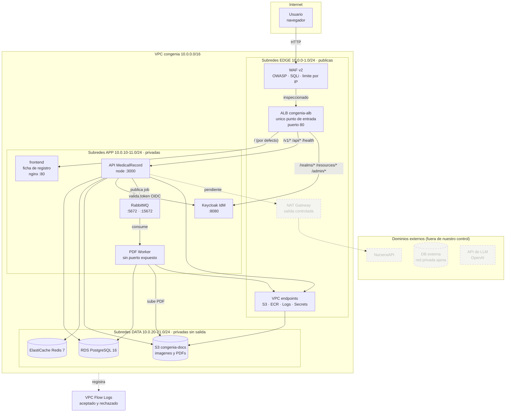

# Arquitectura implementada

> Version visual de este documento: https://claude.ai/code/artifact/a50c18d9-0432-40bd-bed7-6027848dfef3

Lo que quedo corriendo tras `make up`. No es un diseno propuesto: son los
**85 recursos** que Terraform tiene en estado y los **7 contenedores** que
responden en Docker.

---

## Diagrama



Las cajas atenuadas de la derecha son integraciones **declaradas en el diseno
original pero todavia sin componente que las consuma**. Ver la seccion
"Lo que no existe todavia" en [PROPUESTA.md](../PROPUESTA.md).

---

## Cadena de seguridad

El aislamiento se aplica en cuatro niveles independientes. Que uno falle no
abre el camino entero.

```
                    internet
                       │
                  ┌────▼─────┐   1. WAF  (capa 7)
                  │   WAF    │      OWASP · entradas maliciosas · SQLi
                  │          │      limite 2000 req/IP cada 5 min
                  └────┬─────┘
                       │
   2. NACL edge   ═════▼═════   sin estado, permite y DENIEGA
                       │        80/443 + rango efimero de vuelta
                       │
   3. edge-sg    ──────▼──────  con estado, 80/443 desde 0.0.0.0/0
                       │
                       ▼  solo desde edge-sg
   3. app-sg     ─────────────  tareas ECS; entre pares por `self = true`
   2. NACL app   ═════════════  solo trafico de la VPC + efimero
                       │
                       ▼  solo desde app-sg
   3. data-sg    ─────────────  5432 y 6379 unicamente
   2. NACL data  ═════════════  deniega todo lo demas, salida solo a la VPC
                       │
   4. enrutamiento ────────────  las subredes de datos no tienen ruta por
                                 defecto: no hay camino fisico a internet
```

Cuatro controles, cada uno con un alcance distinto:

| Nivel | Control | Que decide | Con estado |
|---|---|---|---|
| 1 | WAF | que *peticiones* pasan | si |
| 2 | NACL | que paquetes entran o salen de una *subred* | no |
| 3 | Security group | quien puede *abrir una conexion* | si |
| 4 | Tabla de rutas | si existe *camino* hacia un destino | — |

Las NACL son el unico nivel que puede denegar de forma explicita: un security
group solo sabe permitir. Y al no tener estado, cada capa necesita una regla
para el rango efimero (1024-65535) de vuelta, que de otro modo parece
sobrante.

`data-sg` no tiene egress a internet y la tabla de rutas de las subredes de
datos no tiene ruta por defecto, asi que la capa de persistencia queda sellada
por partida doble.

---

## Trazabilidad y salida a internet

| Pieza | Que hace |
|---|---|
| **VPC Flow Logs** | Registra la capa de red (aceptado y rechazado) en `/vpc/congenia/flow-logs`. Distinto de los log groups por servicio, que recogen el stdout de cada contenedor. |
| **NAT Gateway** | Unica salida a internet de las subredes privadas, con EIP fija. Hoy sin consumidor: lo justificaran NurseraAPI y el Agent. |
| **VPC endpoint S3** | Las imagenes y PDFs viajan a S3 sin tocar internet ni el NAT. |
| **Endpoints de interface** | ECR (api y dkr), CloudWatch Logs y Secrets Manager alcanzables sin ruta a internet. |

## Acceso a lo que no publica el ALB

RDS, Redis, RabbitMQ y su consola no son alcanzables desde fuera. Para operarlos
el repositorio propone **Client VPN con certificado mutuo** (`modules/vpn`), no
un bastion: no abre puertos de entrada, no hay maquina que parchear y cada
conexion queda registrada. Requiere dos certificados en ACM y **no se pudo
probar** — MiniStack no implementa Client VPN.

El tunel sitio a sitio hacia la base de datos externa de Nursera esta escrito en
el mismo modulo y espera tres datos del otro dominio: IP publica del gateway,
ASN y rangos alcanzables.

---

## Traduccion desde el docker-compose

| `docker-compose.yml` (CONGENIA-ORCH) | Recurso Terraform            | Respaldo en local        |
|--------------------------------------|------------------------------|--------------------------|
| `postgres`                           | `aws_db_instance`            | contenedor postgres:16   |
| `redis`                              | `aws_elasticache_cluster`    | contenedor redis:7       |
| `seaweedfs`                          | `aws_s3_bucket`              | S3 nativo de MiniStack   |
| `rabbitmq`                           | `aws_ecs_service`            | contenedor rabbitmq 3.13 |
| `keycloak`                           | `aws_ecs_service`            | contenedor keycloak 26.6 |
| `api`                                | `aws_ecs_service` + ruta ALB | contenedor congenia/api  |
| `pdf_worker`                         | `aws_ecs_service`            | contenedor pdf-worker    |
| `frontend`                           | `aws_ecs_service` + ruta ALB | contenedor nginx         |
| `playground` (perfil `dev`)          | *no migrado*                 | herramienta de desarrollo |
| red `congenia_network`               | VPC + 6 subredes + 3 SG      | red Docker de MiniStack  |
| — (no existia)                       | `aws_lb` + reglas            | plano de datos del ALB   |
| — (no existia)                       | `aws_wafv2_web_acl`          | WAF asociado al ALB      |
| — (no existia)                       | `aws_flow_log`               | flow logs de la VPC      |
| — (no existia)                       | 3 `aws_network_acl`          | firewall sin estado      |
| — (no existia)                       | 5 `aws_vpc_endpoint`         | S3, ECR, Logs, Secrets   |

`seaweedfs` desaparece como componente: la aplicacion ya hablaba protocolo S3
a traves de `S3_ENDPOINT`, asi que basta apuntar esa variable al bucket. Es la
unica sustitucion que no costo cambios de codigo.

---

## Evidencia

```
$ docker ps
ministack-ecs-...-api          congenia/api:local
ministack-ecs-...-frontend     congenia/frontend:local        (healthy)
ministack-ecs-...-keycloak     quay.io/keycloak/keycloak:26.6.1
ministack-ecs-...-rabbitmq     rabbitmq:3.13-management-alpine
ministack-ecs-...-pdf-worker   congenia/pdf-worker:local
ministack-rds-...-congenia-pg  postgres:16-alpine
ministack-elasticache-...      redis:7-alpine

$ docker logs <api>
[DB] Connected to PostgreSQL
[SERVER] CONGENIA M1 running on port 3000

$ docker logs <pdf-worker>
{"level":"info","message":"Worker is now consuming messages",
 "queue":"consent.pdf.generate"}

$ make smoke
  OK     frontend (ficha)       /                  200   -> "Ficha Genetica - Congenia"
  OK     api                    /v1/ping           404   -> {"success":false,...}
  OK     keycloak               /realms/master     200   -> {"realm":"master",...}
```

La API se conecto a la instancia RDS real y el worker esta consumiendo de la
cola de RabbitMQ real. El recorrido completo
`navegador -> ALB -> tarea privada -> base de datos` funciona.

---

## Evidencia en AWS real

> Diagrama visual del despliegue en AWS, con el estado de cada servicio:
> https://claude.ai/code/artifact/274c5ddc-4d12-4f12-9f98-b97d888eb0ea

El 2026-08-24 el mismo codigo se aplico contra la cuenta `940213460779`
(us-east-1). **88 recursos, 4 de 5 servicios operativos.** El detalle de lo
que fallo y por que esta en [PROPUESTA.md](../PROPUESTA.md) seccion 8b.

```
$ aws ecs describe-services --cluster congenia-prod-cluster
  congenia-prod-api          2/2   corriendo
  congenia-prod-frontend     1/1   corriendo
  congenia-prod-keycloak     1/1   corriendo
  congenia-prod-rabbitmq     1/1   corriendo
  congenia-prod-pdf-worker   0/2   falla: getaddrinfo ENOTFOUND seaweedfs

$ aws elbv2 describe-target-health
  frontend   healthy
  api        healthy healthy
  keycloak   healthy

$ curl http://congenia-prod-alb-307869384.us-east-1.elb.amazonaws.com/...
  /                 200   nginx sirviendo el SPA
  /health           200   {"status":"ok"}    <- la API alcanza RDS
  /v1/ping          404   esperado
  /realms/master    200
  /admin/           302   redirige al login
```

Tres diferencias respecto del entorno local, todas a favor de AWS:

| | MiniStack | AWS real |
|---|---|---|
| Registro de targets en el ALB | requiere `reconcile-alb.sh` | **nativo**, quedaron `healthy` solos |
| Reglas del listener | requiere parche | nativas |
| Asociacion de NACL | `associate_nacls = false` | **funciona** con `true` |

Y dos que no existen en local y hubo que resolver:

- **RDS exige TLS.** El `Pool` de `src/config/db.js` no declara `ssl`, asi que
  hace falta `PGSSLMODE` en el entorno. Un Postgres en contenedor no fuerza
  nada, por eso nunca aparecio.
- **El esquema no se carga solo.** Sin `docker-entrypoint-initdb.d`, RDS nace
  vacio. Se cargo con una tarea ECS de un solo uso: 23 tablas y los seeds.

`pdf-worker` es el unico que no levanto. La causa no es de infraestructura: la
aplicacion busca el host `seaweedfs` porque `envs/aws` no pasa `S3_ENDPOINT`,
y aun pasandolo el cliente S3 esta cableado a credenciales estaticas y no
puede usar el rol IAM de la tarea.
