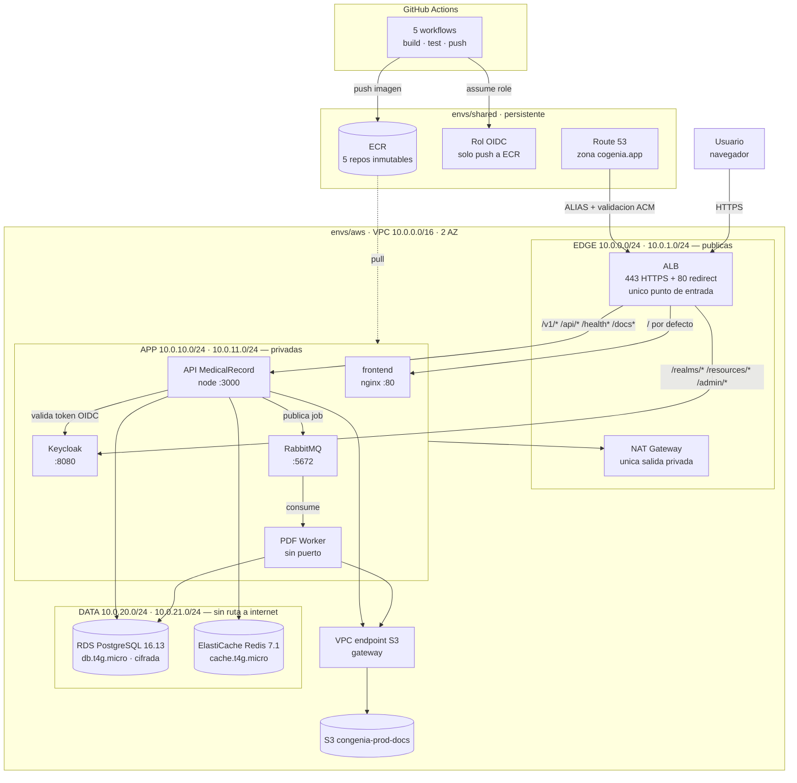

# Arquitectura implementada

Foto de lo que existe y funciona, no de lo que se planeaba. Todo lo que sigue
esta verificado contra la cuenta `940213460779` (us-east-1) y contra el codigo
de este repositorio.

- **121 recursos** en el estado de `envs/aws`
- **5 de 5 servicios** ECS con `desired=1, running=1`
- **3 target groups** del ALB en `healthy`
- **HTTPS activo**: listener 443 con certificado ACM, y el 80 redirigiendo

Lo que esta codificado pero **apagado** tiene su propia seccion al final. Este
documento no lo dibuja como si estuviera corriendo.

---

## Los dos stacks

El estado de Terraform esta partido, y la division es la que gobierna el ciclo
de vida:

| | `envs/shared` | `envs/aws` |
|---|---|---|
| Registro de imagenes | 5 repositorios ECR, inmutables | — |
| Identidad de CI | proveedor OIDC de GitHub + rol de push | — |
| DNS | zona alojada de Route 53 | registros de validacion y ALIAS |
| Computo y datos | — | VPC, ALB, ECS, RDS, Redis, S3, secretos |
| Costo | menos de USD 1/mes | practicamente todo el gasto |

La separacion no es estetica: `make destroy ENV=aws` elimina el gasto real y
deja en pie imagenes, DNS e identidad, de modo que reconstruir es un comando y
no una tarde. Solo `make nuke` toca `envs/shared`.

---

## Diagrama



Los servicios se encuentran entre si por **Cloud Map** (`congenia.internal`),
no por IP: hay tres registrados —`api`, `keycloak`, `rabbitmq`—, que son los
que otros consumen por nombre. `frontend` y `pdf-worker` no necesitan que
nadie los resuelva.

---

## El camino de una peticion

1. El navegador resuelve `cogenia.app` por el **ALIAS de Route 53** hacia el
   ALB. Es un registro ALIAS y no un CNAME porque el apex de un dominio no
   admite CNAME.
2. El **listener 80 redirige** a 443. El 443 presenta el certificado de ACM,
   emitido y renovado solo: Terraform escribe el registro de validacion en la
   zona y espera el `ISSUED`.
3. Las **reglas del listener** deciden por ruta, con prioridad explicita:

   | Prioridad | Rutas | Destino |
   |---:|---|---|
   | 10 | `/v1/*` `/api/*` `/health*` `/openapi.json` `/docs*` | API |
   | 20 | `/realms/*` `/resources/*` `/admin/*` | Keycloak |
   | 100 | resto | frontend |

   El frontend es el destino por defecto, con la prioridad mas alta en numero
   —es decir, la ultima que se evalua—: cualquier cosa que no reclamen la API
   ni Keycloak sirve el SPA.
4. La tarea vive en una **subred privada**. El ALB llega a ella porque el
   `app-sg` acepta trafico del `edge-sg`, no porque la tarea sea alcanzable.
5. Si la peticion toca la base, la API abre conexion a RDS. El `data-sg` solo
   acepta 5432 y 6379, y solo desde `app-sg`.

---

## Cadena de seguridad

Tres controles activos, con alcances distintos, mas uno disponible y apagado.

```
                    internet
                       │
   1. NACL edge   ═════▼═════   sin estado, permite y DENIEGA
                       │        443/80 + rango efimero de vuelta
                       │
   2. edge-sg    ──────▼──────  con estado, 443/80 desde 0.0.0.0/0
                       │
                       ▼  solo desde edge-sg
   2. app-sg     ─────────────  tareas ECS; entre pares por `self = true`
   1. NACL app   ═════════════  solo trafico de la VPC + efimero
                       │
                       ▼  solo desde app-sg
   2. data-sg    ─────────────  5432 y 6379 unicamente
   1. NACL data  ═════════════  deniega el resto, salida solo a la VPC
                       │
   3. enrutamiento ────────────  las subredes de datos no tienen ruta por
                                 defecto: no hay camino fisico a internet
```

| Nivel | Control | Que decide | Con estado | Estado |
|---|---|---|---|---|
| 1 | NACL (3) | que paquetes entran o salen de una *subred* | no | activo |
| 2 | Security group (3) | quien puede *abrir una conexion* | si | activo |
| 3 | Tabla de rutas | si existe *camino* hacia un destino | — | activo |
| — | WAF v2 | que *peticiones* pasan | si | **apagado** |

Las NACL son el unico nivel que puede denegar de forma explicita: un security
group solo sabe permitir. Y al no tener estado, cada capa necesita una regla
para el rango efimero (1024-65535) de vuelta, que de otro modo parece
sobrante.

La persistencia queda sellada por partida doble: `data-sg` no tiene egress a
internet, y la tabla de rutas de esas subredes no tiene ruta por defecto.

---

## Entrega de imagenes

Ningun despliegue construye imagenes. Cada repositorio de servicio publica la
suya al mergear:

| Repositorio | Imagen | Se dispara con |
|---|---|---|
| `CONGENIA-M1-SERVER` | `congenia/api` | merge a `main` |
| `CONGENIA-M1-SERVER` | `congenia/migrate` | merge que toque `db/` |
| `CONGENIA-M1` | `congenia/frontend` | merge a `main` |
| `CONGENIA-M1-PDF-WORKER` | `congenia/pdf-worker` | merge a `main` |
| `CONGENIA-ORCH` | `congenia/keycloak` | merge que toque `keycloak/` |

Cuatro propiedades que definen el diseno:

**Sin llaves de AWS en GitHub.** Los workflows asumen un rol por OIDC, acotado
por repositorio y rama. Ese rol solo puede publicar en los cinco repositorios
ECR: no despliega, no lee secretos, no toca RDS.

**El pipeline publica; no despliega.** Termina abriendo un PR sobre
`envs/aws/images.tfvars`, que es el registro versionado de que version corre.
Mergear ese PR no despliega nada: hace falta `make open ENV=aws`.

**ECR es inmutable.** El workflow comprueba si el tag existe antes de
construir, asi que reintentar un commit ya publicado sale en verde en lugar de
chocar contra el registry.

**El tag sigue al contenido**, derivado del commit: `<version>-<sha7>` para los
servicios, `schema-<sha7 de db/>` para la migracion. `scripts/release-plan.sh`
calcula exactamente los mismos tags desde una laptop, que es la valvula de
escape cuando no se quiere pasar por GitHub.

Una lifecycle policy conserva las ultimas 20 imagenes por repositorio. Deja de
ser opcional cuando se publica en cada merge.

---

## Persistencia

| Componente | Que corre | Notas |
|---|---|---|
| RDS PostgreSQL | 16.13, `db.t4g.micro`, Single-AZ | cifrada, no publica, 1 dia de retencion |
| ElastiCache Redis | 7.1, `cache.t4g.micro` | un nodo |
| S3 | `congenia-prod-docs` | versionado; el task role tiene politica acotada a ese bucket |

El esquema **no se carga solo**: sin `docker-entrypoint-initdb.d`, RDS nace
vacia. Lo carga `modules/migrate`, una task definition de un solo uso que
hornea los `.sql` en su propia imagen y se ejecuta con `make migrate`. Es
idempotente: detecta si la tabla `usuario` ya existe y no hace nada.

RDS **exige TLS**, cosa que un Postgres en contenedor no fuerza. Por eso el
entorno pasa `PGSSLMODE`; sin eso la conexion falla de una forma que no aparece
nunca en local.

---

## Traduccion desde el docker-compose

| `docker-compose.yml` (CONGENIA-ORCH) | En AWS |
|---|---|
| `postgres` | `aws_db_instance` |
| `redis` | `aws_elasticache_cluster` |
| `seaweedfs` | `aws_s3_bucket` |
| `rabbitmq` | `aws_ecs_service` |
| `keycloak` | `aws_ecs_service` |
| `api` | `aws_ecs_service` + regla del ALB |
| `pdf_worker` | `aws_ecs_service` |
| `frontend` | `aws_ecs_service` + regla del ALB |
| `playground` (perfil `dev`) | *no migrado*, es herramienta de desarrollo |
| red `congenia_network` | VPC + 6 subredes + 3 SG + 3 NACL |
| — | ALB, Cloud Map, Secrets Manager, ECR |

`seaweedfs` desaparece como componente: la aplicacion ya hablaba protocolo S3 a
traves de `S3_ENDPOINT`, asi que basto apuntar esa variable al bucket. Es la
unica sustitucion que no costo cambios de codigo.

El sentido inverso tambien importa: los secretos que en local viven en `.env`
aqui los **genera Terraform** y los guarda en Secrets Manager. Las tareas los
reciben por el bloque `secrets` de la task definition, nunca como variables de
entorno en claro.

---

## Pendientes

Estos recursos existen en el codigo y estan escritos, pero **no estan
desplegados**. Cada uno se enciende con su variable y cuesta dinero. No son
ideas: son `terraform apply` de distancia.

### WAF v2 — reglas de capa 7

`enable_waf`. Hoy el ALB acepta cualquier peticion bien formada. El modulo trae
el conjunto gestionado de OWASP, reglas contra SQLi y un limite de 2000
peticiones por IP cada cinco minutos.

Es el unico control que mira el *contenido* de la peticion: las NACL ven
paquetes y los security groups ven conexiones, ninguno distingue un `POST`
legitimo de una inyeccion. Sin WAF, esa capa simplemente no existe.

### VPC endpoints de interfaz

`enable_private_endpoints`. Hoy solo esta el gateway de S3, que no se cobra por
hora. Los de interfaz —ECR api y dkr, CloudWatch Logs, Secrets Manager— cuestan
alrededor de USD 7 al mes cada uno por zona.

Encenderlos permitiria que las tareas saquen imagenes, escriban logs y lean
secretos **sin ruta a internet**, y con ello quitar el NAT Gateway de en medio
para esas dependencias. Es la diferencia entre "las subredes privadas no
reciben conexiones" y "las subredes privadas no necesitan internet".

### VPC Flow Logs

`enable_flow_logs`. Registra la capa de red —aceptado y rechazado— en
`/vpc/congenia/flow-logs`. Es distinto de los log groups por servicio, que solo
recogen el stdout de cada contenedor.

Sin esto no hay forma de responder "quien intento conectarse a la base y fue
rechazado": los security groups deniegan en silencio.

### VPN para alcanzar los servicios protegidos

`enable_client_vpn` y `enable_site_to_site_vpn`.

RDS, Redis y la consola de RabbitMQ no los publica el ALB y no hay bastion, asi
que **hoy no hay forma de operarlos**. El modulo propone Client VPN con
certificado mutuo y no una maquina puente: no abre puertos de entrada, no hay
host que parchear y cada conexion queda registrada. Requiere emitir dos
certificados en ACM.

Hay una consecuencia que conviene mirar de frente: como no existe ese camino
privado, **la consola de administracion de Keycloak se publica por internet**.
La regla del ALB que enruta a Keycloak incluye `/admin/*` junto con
`/realms/*`, de modo que el panel de administracion es alcanzable desde fuera y
lo unico que lo protege es el login de Keycloak. Comprobado:

```
$ curl -o /dev/null -w '%{http_code}' https://cogenia.app/admin/master/console/
200
```

Con la VPN en pie, lo correcto seria sacar `/admin/*` de la regla publica y
dejar esa consola accesible solo por el tunel. Mientras tanto, es una
superficie expuesta que existe porque falta la alternativa, no porque se haya
decidido.

El tunel sitio a sitio hacia la base de datos externa de Nursera esta escrito
en el mismo modulo y espera tres datos del otro dominio: IP publica del
gateway, ASN y rangos alcanzables.

---

## Evidencia

Verificado el 2026-09-03 contra la cuenta real:

```
$ aws ecs describe-services --cluster congenia-prod-cluster
  congenia-prod-api          1/1   corriendo
  congenia-prod-frontend     1/1   corriendo
  congenia-prod-keycloak     1/1   corriendo
  congenia-prod-rabbitmq     1/1   corriendo
  congenia-prod-pdf-worker   1/1   corriendo

$ aws elbv2 describe-target-health
  congenia-prod-api-tg        healthy
  congenia-prod-frontend-tg   healthy
  congenia-prod-keycloak-tg   healthy

$ aws elbv2 describe-listeners
  443  HTTPS  forward
  80   HTTP   redirect

$ aws ec2 describe-subnets
  10.0.0.0/24   edge  us-east-1a      10.0.1.0/24   edge  us-east-1b
  10.0.10.0/24  app   us-east-1a      10.0.11.0/24  app   us-east-1b
  10.0.20.0/24  data  us-east-1a      10.0.21.0/24  data  us-east-1b

$ aws servicediscovery list-services
  api   keycloak   rabbitmq
```

```
$ curl -o /dev/null -w '%{http_code}' https://cogenia.app/realms/master
200
```

El recorrido `navegador -> Route 53 -> ALB con TLS -> tarea privada -> RDS`
funciona de punta a punta. `make smoke` lo comprueba por contenido y no solo
por codigo HTTP, porque con las reglas de path mal aplicadas el ALB devuelve
200 sirviendo el SPA para todas las rutas y un smoke que solo mirara el codigo
daria un falso verde.

---

Los procedimientos para levantar, actualizar y apagar este entorno estan en
[DEPLOY.md](DEPLOY.md).
